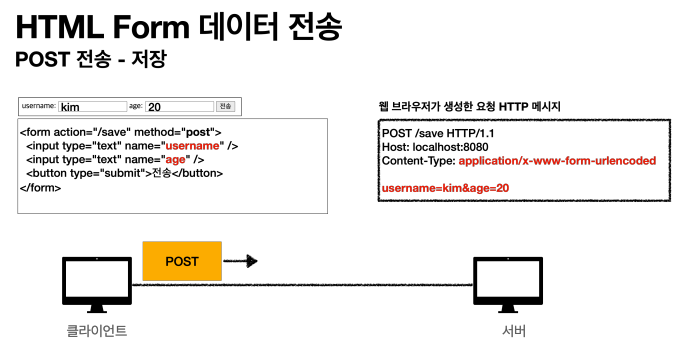

# 파일 업로드 소개
일반적으로 사용하는 HTML Form을 통한 파일 업로드를 이해하려면 먼저 폼을 전송하는 다음 두 가지 방식의 차이를 이해해야 한다.

### HTML 폼 전송 방식
* ```application/x-www-form-urlencoded```
* ```multipart/form-data```

### application/x-www-form-urlencoded 방식
* 
* ```application/x-www-form-urlencoded``` 방식은 HTML 폼 데이터를 서버로 전송하는 가장 기본적인 방법이다.
* Form 태그에 별도의 enctype 옵션이 없으면 웹 브라우저는 요청 HTTP 메시지의 헤더에 다음 내용을 추가한다.
  * ```Content-Type: application/x-www-form-urlencoded```
* 그리고 폼에 입력한 전송할 항목을 HTTP Body에 문자로 username=kim&age=20 와 같이 & 로 구분해서 전송한다.
* 파일을 업로드 하려면 파일은 문자가 아니라 바이너리 데이터를 전송해야 한다. 문자를 전송하는 이 방식으로 파일을 전송하기는 어렵다. 그리고 또 한가지 문제가 더 있는데, 보통 폼을 전송할 때 파일만 전송하는 것이 아니라는 점이다.
  * 다음 예를 보자.
    * 이름
    * 나이
    * 첨부파일
  * 여기에서 이름과 나이도 전송해야 하고, 첨부파일도 함께 전송해야 한다. 문제는 이름과 나이는 문자로 전송하고, 첨부파일은 바이너리로 전송해야 한다는 점이다. 여기에서 문제가 발생한다. 문자와 바이너리를 동시에 전송해야 하는 상황이다.
  * 이 문제를 해결하기 위해 HTTP는 ```multipart/form-data``` 라는 전송 방식을 제공한다.

### multipart/form-data 방식
* 
* 이 방식을 사용하려면 Form 태그에 별도의 ```enctype="multipart/form-data"``` 를 지정해야 한다.
* ```multipart/form-data``` 방식은 다른 종류의 여러 파일과 폼의 내용 함께 전송할 수 있다. (그래서 이름이 multipart 이다.)
* 폼의 입력 결과로 생성된 HTTP 메시지를 보면 각각의 전송 항목이 구분이 되어있다. ```Content-Disposition``` 이라는 항목별 헤더가 추가되어 있고 여기에 부가 정보가 있다. 예제에서는 username , age , file1 이 각각 분리되어 있고, 폼의 일반 데이터는 각 항목별로 문자가 전송되고, 파일의 경우 파일 이름과 ```Content-Type```이 추가되고 바이너리 데이터가 전송된다.
* multipart/form-data 는 이렇게 각각의 항목을 구분해서, 한번에 전송하는 것이다.

### Part
```multipart/form-data``` 는 ```application/x-www-form-urlencoded``` 와 비교해서 매우 복잡하고 각각의 부분( Part )으로 나누어져 있다.